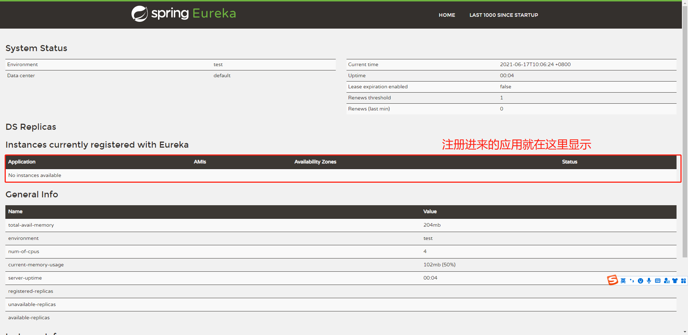
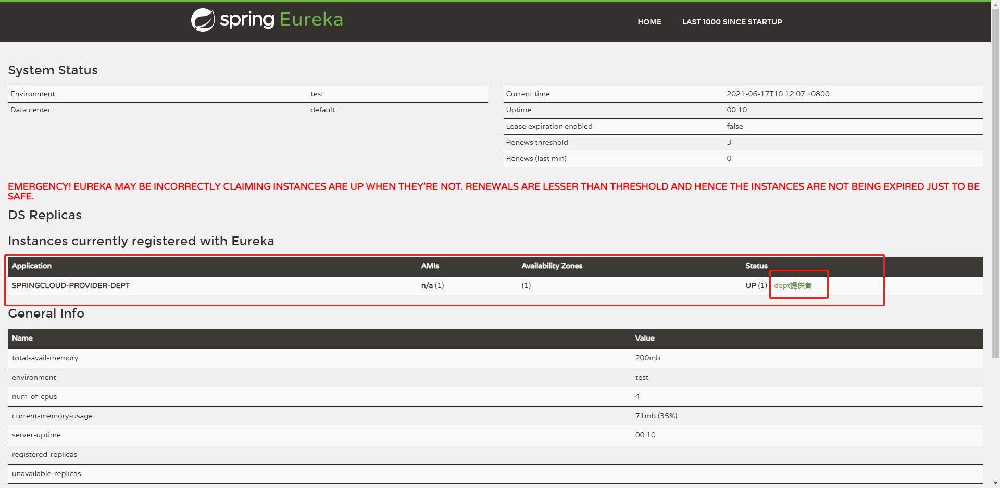

 

## 1.配置步骤

1.导入maven依赖

2.在spring配置文件中配置eureka相关配置

3.开启这个功能

4.配置类（可能需要）

## 2.服务端配置

1.加入依赖

```xml
<dependency>
        <groupId>org.springframework.cloud</groupId>
        <artifactId>spring-cloud-starter-eureka-server</artifactId>
        <version>1.4.0.RELEASE</version>
    </dependency>
```

2.配置application

```yml
#Eureka配置
eureka:
  instance:
    hostname: localhost  #Eureka服务端实例名称
  client:   #服务端配置
    register-with-eureka: false   #是否向Eureka注册自己
    fetch-registry: false   #为false则表示自己就是注册中心
    service-url:
      defaultZone: http://${eureka.instance.hostname}:${server.port}/eureka/
```

3.启动类加标签

```java
@SpringBootApplication
@EnableEurekaServer
public class EurekaServer {
    public static void main(String[] args) {
        SpringApplication.run(EurekaServer.class,args);
    }
}
```

完成，进入http://localhost:7001/看看效果



## 3.将生产者模块注册

1.加入依赖

```xml
<dependency>
    <groupId>org.springframework.cloud</groupId>
    <artifactId>spring-cloud-starter-eureka</artifactId>
    <version>1.4.0.RELEASE</version>
</dependency>
```

2.配置文件

```yml
#eureka的配置
eureka:
  client:
    service-url:
      defaultZone: http://localhost:7001/eureka/    #注册中心地址

```

3.启动类加标签

```java
@SpringBootApplication
@EntityScan(basePackages = "com.ljj.springcloud")
@EnableEurekaClient
public class DeptProvider {
    public static void main(String[] args) {
        SpringApplication.run(DeptProvider.class,args);
    }
}
```

完成！



4.要修改默认描述信息，需要改配置文件

```yml
#eureka的配置
eureka:
  client:
    service-url:
      defaultZone: http://localhost:7001/eureka/    #注册中心地址
  instance:
    instance-id: dept提供者  #用来修改注册中心上此应用的默认描述信息
```

5.点击默认信息后会跳转到另一个页面，想要修改跳转的页面信息可以加个配置：

5.1 加依赖包

```xml
<!-- actuator完善监控信息-->
<dependency>
    <groupId>org.springframework.boot</groupId>
    <artifactId>spring-boot-starter-actuator</artifactId>
</dependency>
```

5.2 配置文件修改

```yml
#引入actuator依赖后，配置info中的信息，即可在erueka点击描述后显示出来
info:
  name: 李炯炯
  company: 陕汽
```

## 4.集群搭建

