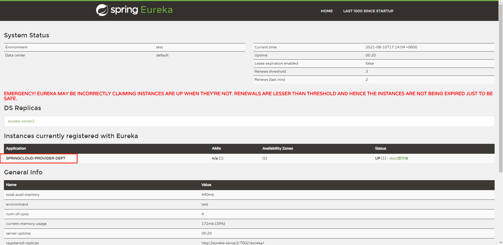

### 定义：

一套客户端负载均衡（Load Balance）的工具


### 分类：

##### 集中式LB:

在服务的消费方和提供方之间使用独立的LB设施，例如Nginx，由该设施负责把访问请求通过某种策略转发至服务的提供方。

##### 进程式LB:

将LB逻辑集成到消费方，消费方从服务注册中心获知有哪些地址可用，然后自己再从这些地址中选出一个合适的服务器。

Ribbon就属于进程内LB、**它只是一个类库，集成于消费方进程**，消费方通过它来获取到服务提供方的地址。


### 与Eureka集成：

通常，一个微服务架构只有有一个客户端（消费者），将ribbon和eureka同时集成进这个客户端即可：

1.加依赖：

```xml
<!--ribbon-->
<dependency>
    <groupId>org.springframework.cloud</groupId>
    <artifactId>spring-cloud-starter-ribbon</artifactId>
    <version>1.4.0.RELEASE</version>
</dependency>
<dependency>
    <groupId>org.springframework.cloud</groupId>
    <artifactId>spring-cloud-starter-eureka</artifactId>
    <version>1.4.0.RELEASE</version>
</dependency>
```

2.配置文件（其实是配置eureka）：

```yml
#Eureka配置
eureka:
  client:
    register-with-eureka: false  #不注册自己（消费者没必要，又没人调用他）
    service-url:
      defaultZone: http://eureka-server1:7001/eureka/,http://eureka-server2:7002/eureka/    #注册中心地址
```

3.加标签：

3.1 主启动类上加上eureka 的标签@EnableEurekaClient

3.2 在restTemplate的生产方法上加@LoadBalanced

```java
@Configuration
public class ConfigBean {
    //给容器中加入restTemplate
    @Bean
    @LoadBalanced //加个这个注解就可以实现ribbon负载均衡
    public RestTemplate restTemplate(){
        return new RestTemplate();
    }
}
```

4.使用restTemplate时就会发生变化，以前直接访问写好的地址和端口，现在就只需要写应用名就能访问到



```java
public class DeptConsumerContorller {
@Autowired
    private RestTemplate restTemplate;
    //原来直接访问提供者的端口，集成ribbon后就可以通过在注册中心的应用名称来访问具体应用了
    //private final static String REST_URL_PREFIX="http://localhost:8001/dept";
    private final static String REST_URL_PREFIX="http://SPRINGCLOUD-PROVIDER-DEPT:8001/dept";
@RequestMapping("/list")
public List<Dept> list (){
    return restTemplate.getForObject(REST_URL_PREFIX+"/list",List.class);
}
}
```

